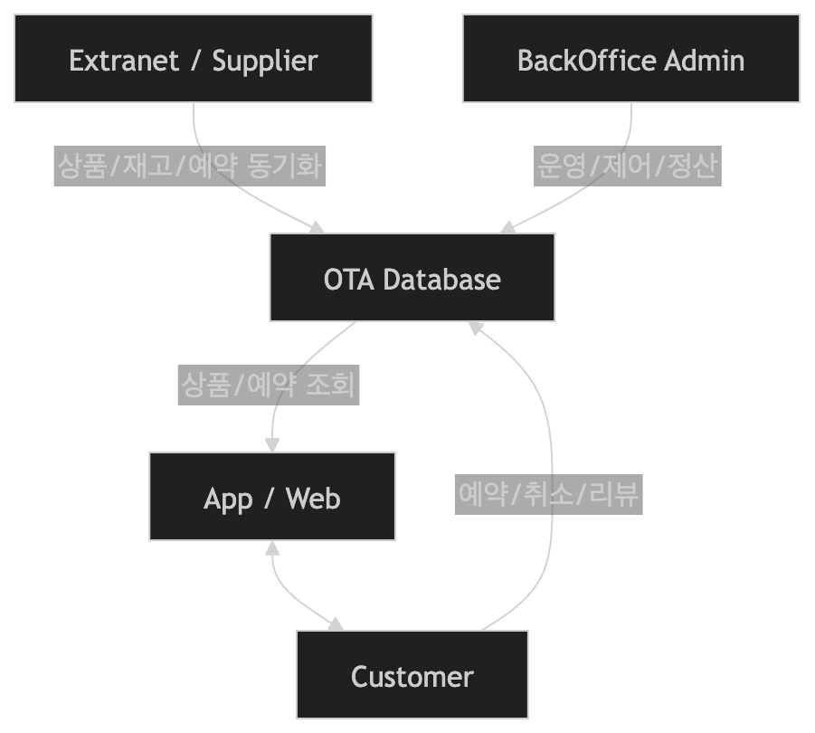

# Step 1. Domain Design

## 1. 프로젝트 목표
이 프로젝트는 숙소 판매자가 숙소와 객실을 등록하고, 고객이 이를 검색하고 예약하며, 운영자가 전체 거래를 관리하는 OTA 서비스를 만드는 것을 목표로 한다.

서비스가 제공해야 하는 핵심 기능은 다음과 같다.
- 판매자는 숙소 및 객실을 등록하고, 요금과 재고를 관리할 수 있어야 한다.
- 외부 공급사 연동을 통해 숙소 및 객실 정보를 제공하고, 예약 정보를 동기화할 수 있어야 한다.
- 고객은 원하는 조건으로 숙소를 검색하고 예약 및 취소할 수 있어야 한다.
- 운영자는 예약, 취소, 환불, 판매자 관리, 고객 문의를 처리할 수 있어야 한다.

## 2. 참고 서비스 및 자료
- Extranet
  - Booking.com Partner Center
  - https://partner.booking.com/ko/자세히-알아보기/신규-파트너/숙소-페이지-설정-및-예약-접수-방법
- Supplier API
  - ONDA Developers
  - https://developers.onda.me/docs/
- Customer 서비스 참고
  - 여기어때
  - https://www.yeogi.com/
- Admin 참고
  - Select Admin
  - https://showroom.selectfromuser.com/home

## 3. 주요 사용자와 역할

### 3.1 판매자(Extranet)
숙소를 직접 운영하거나 판매하는 주체다. Extranet을 통해 자사 숙소 정보를 등록하고 운영한다.
- 숙소 및 객실 정보 관리
- 영업 상태 및 재고 관리

### 3.2 공급사(Supplier)
숙박 상품 및 판매 채널 연동을 통해 데이터를 공급한다.
- 외부 숙소 데이터 조회
- 예약 가능 재고 확인
- 예약 상태 동기화

### 3.3 고객(Customer)
앱/웹을 통해 숙소를 탐색하고 예약하는 사용자다.
- 조건에 맞는 숙소 검색
- 숙소 상세 확인
- 객실 선택 및 예약
- 예약 내역 조회
- 예약 취소 요청
- 이용 후 리뷰 작성

### 3.4 운영자(Admin)
플랫폼 전체를 운영하는 내부 관리자다.

- 판매자 관리
- 예약 및 취소/환불 관리
- 이벤트/디스플레이 상품 관리
- 고객 문의 대응
- 이상 거래 및 운영 이슈 대응
- 통계 및 운영 지표 관리

## 4. 상위 아키텍처 개요

핵심 포인트는 다음과 같다.
- 판매자 직접 등록과 외부 공급사 연동이 모두 내부 OTA 도메인으로 통합 관리되어야 한다.
- 재고와 예약은 읽기보다 쓰기 충돌이 중요한 영역이므로 동시성 제어가 핵심이다.
- 조회 트래픽이 높은 검색과 상세 조회는 별도의 최적화가 필요하다.

## 5. 핵심 업무 흐름

### 5.1 숙소 등록 흐름
1. 판매자가 Extranet에서 숙소를 등록한다.
2. 숙소 하위에 객실 정보를 등록한다.
3. 객실별 가격, 재고, 판매 가능 상태를 설정한다.
4. 운영 정책 또는 검수 절차를 거쳐 노출 가능 상태로 전환된다.
5. 고객 검색 결과에 노출된다.

### 5.2 고객 예약 흐름
1. 고객이 지역, 날짜, 인원, 필터 조건으로 숙소를 검색한다.
2. 고객이 숙소 상세에서 객실, 가격, 정책을 확인한다.
3. 예약 가능한 객실을 선택한다.
4. 예약 요청 시점에 재고를 점검하고 점유한다.
5. 결제가 완료되면 예약을 확정한다.
6. 예약 완료 내역을 확인할 수 있다.

### 5.3 예약 취소 흐름
1. 고객 또는 운영자가 예약 취소를 요청한다.
2. 취소 가능 여부를 취소 정책 기준으로 판단한다.
3. 환불 금액이 있다면 환불 규칙을 적용한다.
4. 예약 상태를 취소로 변경한다.
5. 회수된 재고를 다시 판매 가능 상태로 반영한다.

## 6. 도메인 속성 및 관계

### 6.1 숙소
고객이 예약하는 상위 상품 단위다.

- 숙소명
- 소개 정보
- 판매자 정보
- 주소/위치
- 숙소 타입(호텔, 모텔, 펜션 등)
- 편의시설
- 이미지
- 운영 상태

### 6.2 객실
숙소 하위의 실제 판매 단위다.

- 객실명
- 기준 인원 / 최대 인원
- 객실 타입(스탠다드룸, 디럭스룸, 스위트룸, 패밀리룸 등)
- 침대 정보(싱글, 더블, 트윈 등)
- 객실 이미지
- 객실별 정책
- 판매 상태

### 6.3 요금
특정 숙소/객실이 특정 조건에서 판매되는 금액이다.

- 날짜별 가격
- 인원 조건
- 주중/주말 가격 차이
- 공급가/판매가

### 6.4 재고
판매 가능한 객실 수량 또는 예약 가능 여부를 의미한다.

- 날짜별 재고
- 객실별 재고
- 판매 가능 상태

### 6.5 예약
고객이 특정 기간 동안 특정 객실을 이용하기 위해 확정한 거래 단위다.

- 예약 번호
- 고객 정보
- 숙소/객실 정보
- 체크인/체크아웃 날짜
- 인원
- 결제 금액
- 예약 상태
- 취소 시각

### 6.6 결제
예약 확정에 필요한 거래 수단이다.
- 결제 번호
- 예약 번호
- 결제 금액
- 결제 수단(카드, 계좌이체, 포인트 등)
- 결제 상태(성공, 실패, 환불 등)
- 결제 시각

### 6.7 환불
예약 취소 시 발생하는 금액 반환 단위다.
- 환불 번호
- 고객 정보
- 예약 번호
- 결제 번호
- 환불 시각
- 환불 금액
- 환불 수단
- 환불 상태
- 환불 사유